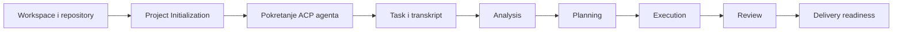
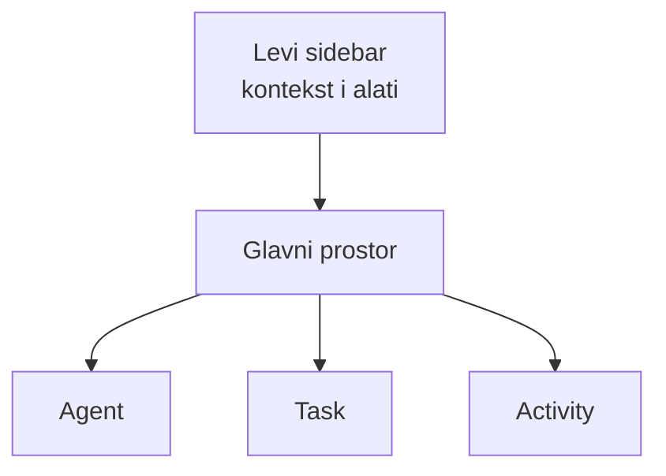
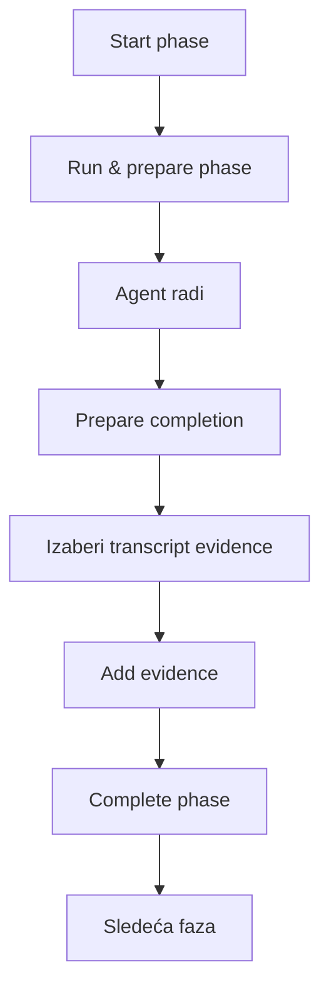
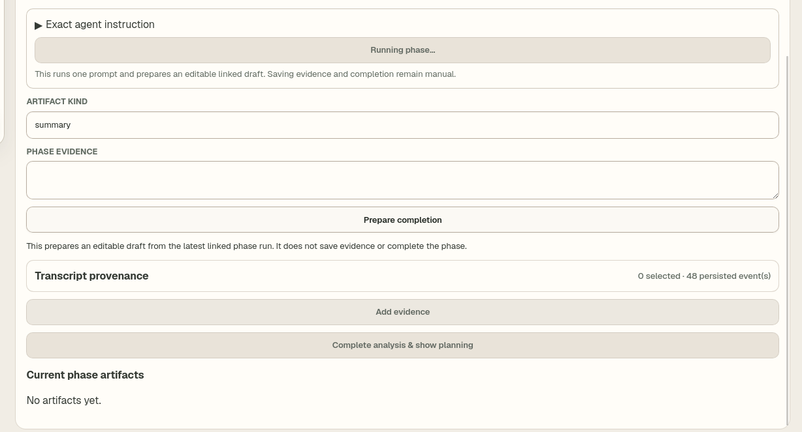

# AIadne — korisničko uputstvo

> Dokument opisuje funkcije koje su trenutno implementirane u AIadne aplikaciji.
> Nazivi dugmadi ostavljeni su na engleskom da bi se lako pronašli na ekranu.

## 1. Šta je AIadne?

AIadne je desktop radni prostor za rad sa programerskim AI agentima. Povezuje:

- projekat i njegove repozitorijume;
- ACP agente i rezervni PTY terminal;
- jedan trajni Task po agentskoj sesiji;
- transkript razgovora;
- faze `analysis → planning → execution → review`;
- dokaze i sačuvane rezultate faza;
- znanje o projektu;
- nezavisne advisor/reviewer izveštaje;
- read-only proveru spremnosti Git repozitorijuma za isporuku.

AIadne je trenutno kontrolisani radni prostor, a ne potpuno automatski
„uradi sve“ sistem. Agent priprema rad, ali korisnik ručno bira dokaz i potvrđuje
završetak svake faze.

## 2. Kako je ekran organizovan?

### Levi sidebar

Sidebar služi za izbor konteksta i upravljanje alatima:

| Deo | Namena |
|---|---|
| **Workspace** | Izbor projekta. |
| **Repository** | Izbor repozitorijuma unutar projekta. |
| **ACP Registry** | Pronalazi ACP-kompatibilne agente i bira koji će se pokrenuti. |
| **Session History** | Otvara, filtrira, preimenuje ili nastavlja ranije sesije. |
| **Knowledge Cards** | Kreira i bira ručne kartice znanja koje agent dobija kao kontekst. |
| **Agent Doctor** | Proverava dostupnost lokalnih agent CLI alata i prebacuje ACP/PTY režim. |
| **Runtime info** | Prikazuje status, skraćeni ID sesije i aktivni direktorijum. |

Na manjim ekranima sidebar se otvara dugmetom **Menu**.

### Glavni radni prostor

Glavni prostor ima tri prikaza:

- **Agent** — pokretanje agenta, izbor modela, slanje poruka i prikaz izlaza;
- **Task** — faze aktivnog zadatka, istorija pokretanja i dokazi;
- **Activity** — advisor/reviewer izveštaji i delivery readiness.

## 3. Workspace i Repository

### Choose Workspace

Ovde se bira postojeći projekat ili dodaje novi:

1. unesi ime projekta;
2. unesi putanju ili klikni **Choose Folder**;
3. klikni **Add Project**.

Brisanje projekta otvara posebnu potvrdu. Projekat ne može bezbedno da se briše
dok aktivna sesija drži njegov runtime.

### Choose Repository

Projekat može imati više repozitorijuma. U ovom dijalogu možeš:

- izabrati aktivni repozitorijum;
- dodati repozitorijum pomoću imena i putanje;
- obrisati dodatni repozitorijum.

Podrazumevani repozitorijum projekta ne može se obrisati iz ovog dijaloga.
Aktivni repozitorijum određuje radni direktorijum agenta i Git proveru u
**Delivery readiness**.

## 4. Project Initialization

Inicijalizacija pravi proverljiv početni kontekst projekta. Sažeti prikaz može da
se otvori i zatvori dugmetom **Open setup**.

Tok je:

1. **Initialize Project** — bira repozitorijume koji ulaze u inicijalizaciju.
2. **Collect Facts** — izvlači determinističke činjenice iz repozitorijuma.
3. **Analyze Markdown** — analizira Markdown dokumentaciju i nalazi signale ili
   moguća neslaganja.
4. **Open Interview** — ručno dodaje guardrail pravila i važne napomene.
5. **Generate Summary** — AI pravi sažetak iz prikupljenih izvora.
6. **Approve Summary** — korisnik potvrđuje sažetak.

### Facts

Facts su proverljive informacije iz projekta. **View Facts** prikazuje grupisane
detalje, umesto da se veruje slobodnom opisu agenta.

### Markdown findings

**View Findings** prikazuje šta je analiza dokumentacije pronašla. Nalaz nije
automatski istina; služi kao signal za proveru.

### Interview Guardrails

Guardrail je pravilo koje agent treba da zna. Sadrži:

- **Scope** — važi za projekat ili određeni repozitorijum;
- **Type** — vrstu pravila;
- **Path or glob** — opcionu putanju na koju se odnosi;
- **Content** — samo pravilo ili objašnjenje.

Guardrails se prvo dodaju u nacrt, a zatim čuvaju zajedno.

### Summary model

Pre generisanja sažetka bira se nivo i model za sintezu. To je odvojeno od
modela koji će kasnije pisati kod. **Approve Summary** zaključava odobreni
rezultat inicijalizacije i objavljuje izvedene knowledge units.

## 5. ACP Registry i pokretanje agenta

**ACP Registry** prikazuje pronađene ACP-kompatibilne kandidate. Tipičan tok:

1. klikni **Refresh**;
2. izaberi kandidata pomoću **Select**;
3. u Agent prikazu klikni **Start Selected ACP**;
4. po potrebi izaberi coding model koji je prijavio sam agent;
5. napiši prompt;
6. pregledaj **Preview Context**;
7. pošalji poruku.

ACP daje strukturisane događaje: poruke, pozive alata, rezultate i zahteve za
dozvolu. Ako agent traži dozvolu, korisnik mora eksplicitno da odgovori.

Izbor coding modela ne menja globalnu konfiguraciju instaliranog CLI alata.

## 6. Agent i Session Output

### ACP Events

Tok aktivne ACP sesije prikazuje se kao lista strukturisanih događaja. Dok agent
radi, interfejs pokazuje stanje čekanja. Događaji se trajno beleže u transkript.

### Saved Transcript

Kada se iz istorije otvori sačuvana sesija, **Session Output** prikazuje njen
transkript. **View Live ACP** vraća prikaz na trenutno aktivnu sesiju.

### PTY Stream

Ako ACP nije dostupan, **Agent Doctor → Open PTY** otvara rezervni terminal.
U terminal se kuca direktno. Kontrole omogućavaju:

- **Start Codex** — pokretanje stvarnog Codex CLI-ja;
- **Start Fake** — testni runtime;
- **Drain** — preuzimanje dostupnog izlaza;
- **Resize** — usklađivanje veličine terminala;
- **Stop** — uredno zaustavljanje;
- **Kill** — prinudno zaustavljanje.

PTY je rezervni interaktivni režim i nema sve strukturisane ACP mogućnosti.

## 7. Session History i Task identitet

Jedna ACP/transkript sesija predstavlja jedan **Task**. Nove poruke u istoj
sesiji nastavljaju isti Task umesto pravljenja duplikata.

U **Session History** možeš:

- filtrirati sesije po naslovu ili sadržaju;
- kliknuti sesiju da otvoriš njen sačuvani transkript;
- promeniti naslov pomoću **Rename**;
- nastaviti ACP sesiju pomoću **Resume**.

**Resume** ponovo učitava identitet stvarne ACP sesije i istoriju, a zatim
omogućava nastavak razgovora. Dugme prikazuje:

- **Resuming…** dok učitavanje traje;
- **Locked** kada druga aktivna ACP sesija prvo mora da se zaustavi.

Otvaranje transkripta je pregled istorije; **Resume** je ponovno pokretanje
agenta sa kontinuitetom sesije.

## 8. Knowledge Cards i Task Context

Knowledge Card je ručno znanje koje korisnik želi da sačuva. Kartica ima:

- naslov;
- vrstu;
- tekst.

Kartice se označavaju u sidebaru. Označene kartice ulaze u pregled konteksta
sledeće poruke.

**Preview Context** pokazuje šta će agent stvarno dobiti:

- originalni korisnički prompt ostaje sačuvan odvojeno;
- inicijalizacioni sažetak i relevantno znanje mogu biti pridodati payload-u;
- korisnik pre slanja vidi podudaranja i može da potvrdi
  **Send with this context**.

Task-specifični dokazi nisu isto što i projektne Knowledge Cards ili objavljeni
knowledge units.

## 9. Task faze

Task prolazi kroz četiri kanonske faze:

| Faza | Šta treba da proizvede |
|---|---|
| **analysis** | Razumevanje problema, relevantnog koda, zavisnosti i rizika. |
| **planning** | Konkretan plan rada i kriterijume provere. |
| **execution** | Izvedeni rad i tehničke rezultate. |
| **review** | Proveru rezultata, nalaze i završnu procenu. |

Faza može biti `pending`, aktivna ili završena. Dugme **Start analysis** pokreće
prvu fazu. Zatim se za svaku fazu ponavlja isti kontrolisani postupak.

### Exact agent instruction

Ovaj sklopivi deo pokazuje tačan prompt koji je AIadne poslala agentu za
trenutnu fazu. Namenjen je proveri i reviziji.

### Run & prepare

Pokreće jedan agentski prompt za fazu. Kada se završi, AIadne priprema izmenjiv
nacrt, ali ne čuva dokaze i ne završava fazu umesto korisnika.

### Artifact kind

Vrsta rezultata. Na primer, `summary` znači tekstualni sažetak. Artifact je
sačuvan rezultat faze, ne mora biti fajl u repozitorijumu.

### Phase evidence

Tekst rezultata ili obrazloženja koje će biti sačuvano. Može se izmeniti pre
čuvanja.

### Transcript provenance

Lista trajno sačuvanih događaja iz transkripta. Korisnik bira konkretne događaje
koji podržavaju rezultat. Tako kasnije može da se utvrdi odakle tvrdnja potiče.

### Add evidence

Čuva artifact zajedno sa izabranim izvorima. Dugme je onemogućeno kada:

- vrsta ili sadržaj nisu popunjeni;
- nijedan događaj transkripta nije izabran;
- druga akcija još traje.

### Complete phase

Završava fazu i prikazuje sledeću. Za poslednju fazu završava Task.
Dugme je dostupno tek kada postoji potreban dokaz. To sprečava završavanje faze
bez proverljivog rezultata.

### Current phase artifacts

Prikazuje sve već sačuvane rezultate tekuće faze i njihove izvore.

## 10. Ekran sa slike — detaljno

Na prikazanom ekranu:

1. **Running phase…** znači da agentski prompt još traje.
2. `summary` je predložena vrsta artifact-a.
3. **Phase evidence** je još prazno.
4. **Prepare completion** će pripremiti nacrt iz poslednjeg povezanog run-a.
5. **0 selected · 48 persisted event(s)** znači da postoji 48 trajno sačuvanih
   događaja, ali nijedan još nije izabran kao dokaz.
6. **Add evidence** je sivo jer nema sadržaja i izabranog izvora.
7. **Complete analysis & show planning** je sivo jer analiza još nema sačuvan
   dokaz.
8. **No artifacts yet** potvrđuje da rezultat faze još nije sačuvan.

Šta treba uraditi:

1. sačekaj završetak `Running phase…`;
2. klikni **Prepare completion**;
3. pročitaj i po potrebi ispravi sadržaj;
4. proširi **Transcript provenance**;
5. izaberi događaje koji zaista dokazuju rezultat;
6. klikni **Add evidence**;
7. proveri da se artifact pojavio u listi;
8. klikni **Complete analysis & show planning**.

## 11. Istorija pokretanja i oporavak

AIadne odvojeno čuva:

- **Task phase run history** — svaki pokušaj agentskog rada za fazu;
- **Task dispatch history** — svaki poslati kontekst/prompt i njegov status.

Pending zapis može ručno da se označi kao neuspešan ako je runtime prekinut.
Posle neočekivanog prekida pojavljuje se **Interrupted work needs review** sa
prečicom do problematičnog phase run-a ili context send-a.

Oporavak ne treba naslepo da nastavi rad: korisnik prvo pregleda šta je ostalo u
neodređenom stanju.

## 12. Advisor & reviewer reports

U **Activity** prikazu mogu se pokrenuti sekundarni, read-only agenti:

- **Run advisor** — traži savet ili rizike za aktivnu fazu;
- **Run reviewer** — traži nezavisnu proveru;
- **Refresh** — ponovo učitava sačuvane izveštaje.

Ovi agenti rade nad izolovanim snapshot-om i ne menjaju glavni Task niti
repozitorijum. Nalaz može da se označi kao rešen ili da se pomoću
**Draft follow-up** pretvori u nacrt poruke glavnom agentu. Sam nacrt još ništa
ne šalje dok ga korisnik ne potvrdi.

## 13. Delivery readiness

**Delivery readiness** je read-only pregled aktivnog Git repozitorijuma. Prikazuje
signale kao što su:

- da li repozitorijum postoji i može da se pročita;
- aktivna grana;
- da li radno stablo ima izmene;
- odnos prema upstream grani kada je dostupan;
- sažetak razloga zbog kojih isporuka još nije spremna.

**Refresh** ponavlja proveru. Ovaj panel ne radi commit, push, merge niti Ship.
On samo prikazuje stanje i dokaze; mutacije ostaju van trenutne funkcionalnosti.

## 14. Zašto je dugme sivo?

| Dugme | Najčešći razlog |
|---|---|
| **Start Selected ACP** | Kandidat nije izabran, nema workspace-a ili sesija već radi. |
| **Send** | ACP sesija nije spremna, prompt je prazan ili prethodni prompt traje. |
| **Resume** | Aktivna ACP sesija prvo mora da se zaustavi ili druga akcija traje. |
| **Generate Summary** | Nedostaju izvori, model ili inicijalizacija još nije spremna. |
| **Add evidence** | Nema sadržaja ili nije izabran transcript source. |
| **Complete phase** | Nema sačuvanog artifact-a/dokaza za trenutnu fazu. |
| **Run advisor/reviewer** | Nema aktivnog Task-a/faze, nema kandidata ili izveštaj već radi. |
| **Refresh delivery** | Nije izabran repozitorijum. |

## 15. Rečnik

| Pojam | Značenje |
|---|---|
| **ACP** | Protokol za strukturisanu komunikaciju aplikacije sa AI agentom. |
| **PTY** | Interaktivni terminal kao rezervni način rada. |
| **Task** | Trajni zadatak vezan za jednu agentsku/transkript sesiju. |
| **Phase** | Kontrolisana etapa: analysis, planning, execution ili review. |
| **Run** | Jedan pokušaj izvršavanja agentske akcije. |
| **Artifact** | Sačuvan rezultat faze. |
| **Evidence** | Sadržaj i izvori koji podržavaju rezultat. |
| **Provenance** | Poreklo podatka: koji događaj, sesija, faza i agent. |
| **Transcript** | Trajno sačuvana istorija događaja sesije. |
| **Knowledge Card** | Ručno kreirano projektno znanje koje se može dodati kontekstu. |
| **Knowledge Unit** | Strukturisano znanje objavljeno iz odobrene inicijalizacije. |
| **Guardrail** | Eksplicitno pravilo ili ograničenje za rad agenta. |
| **Context preview** | Pregled tačnog konteksta pre slanja agentu. |
| **Advisor/Reviewer** | Izolovan read-only agent koji daje nalaz, bez menjanja Task-a. |
| **Delivery readiness** | Read-only pregled spremnosti Git repozitorijuma za isporuku. |

## 16. Najkraći praktični tok

1. Izaberi **Workspace** i **Repository**.
2. Završi **Project Initialization** i odobri Summary.
3. U **ACP Registry** izaberi agenta.
4. Pokreni ga kroz **Start Selected ACP**.
5. Napiši zahtev i pregledaj **Preview Context**.
6. Pošalji poruku; time nastaje ili se nastavlja Task.
7. U Task prikazu pokreni `analysis`.
8. Posle svakog agentskog run-a pripremi rezultat, izaberi transkript dokaze,
   dodaj evidence i tek onda završi fazu.
9. Ponovi za `planning`, `execution` i `review`.
10. Po potrebi pokreni advisor/reviewer i obradi nalaze.
11. U **Delivery readiness** proveri stanje repozitorijuma.

Kada nisi sigurna šta se događa, proveri redom:

1. status na dnu sidebar-a;
2. aktivni Agent/Task/Activity tab;
3. **Session Output**;
4. **Session History**;
5. upozorenje **Interrupted work needs review**;
6. onemogućeno dugme i njegov tooltip.
